# LAB 03 - Análise Exploratória com o Dashboard AI/BI


### 📋 Objetivos do Lab

Neste laboratório, você aprenderá a:
- Criar dashboards interativos a partir de tabelas do Catalog
- Utilizar diferentes tipos de visualizações
- Configurar filtros e interações
- Criar análises geoespaciais
- Publicar e compartilhar seus dashboards
- Utilizar o Ask Genie para insights avançados

---

## 📝 Passo a Passo

### Passo 1 - Entre no menu CATALOG

Acesse o menu **CATALOG** no workspace da Databricks para visualizar suas tabelas e dados disponíveis.

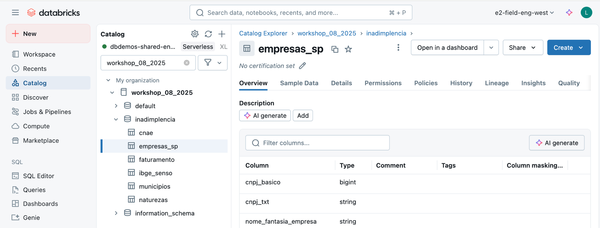

---

### Passo 2 - Clique na Opção "Open in Dashboards"

Selecione a tabela que deseja visualizar e clique na opção **"Open in Dashboards"** para iniciar a criação do seu dashboard.

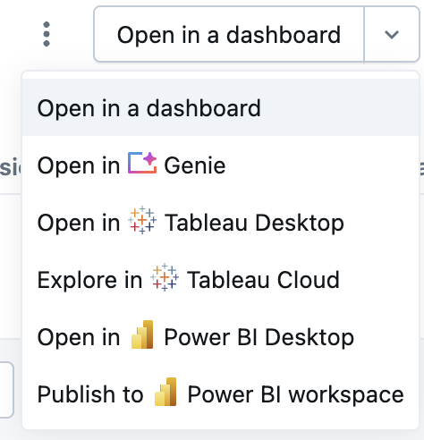

---

### Passo 3 - Crie um Indicador de Quantidades

Crie seu primeiro componente: um indicador (KPI) que mostra quantidades ou métricas importantes do seu conjunto de dados.

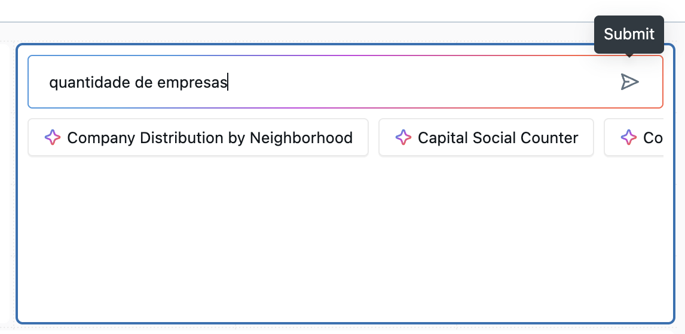

---

### Passo 4 - Crie um Filtro de Página

Adicione um filtro de página para permitir que os usuários filtrem os dados exibidos em todo o dashboard.

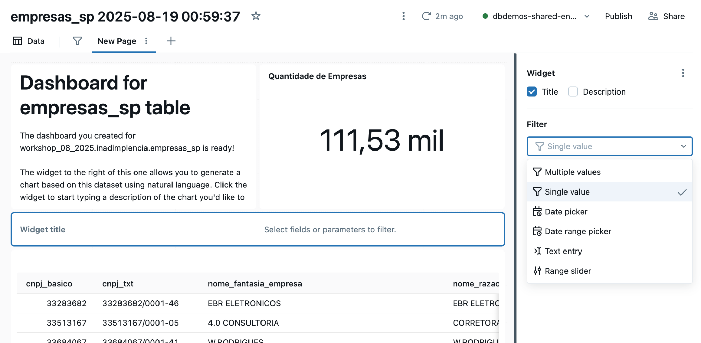

---

### Passo 5 - Faça uma Pesquisa TEXTUAL

Utilize a funcionalidade de pesquisa textual para encontrar rapidamente dados específicos ou criar visualizações baseadas em consultas em linguagem natural.

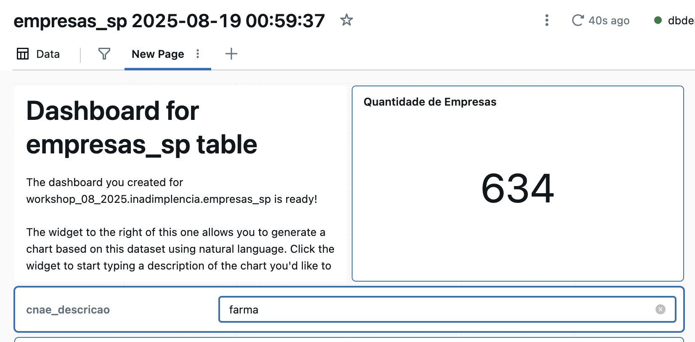

---

### Passo 6 - Crie um MAPA (Point Map)

Adicione uma visualização de mapa de pontos para análise geoespacial dos seus dados. Ideal para visualizar distribuições geográficas.

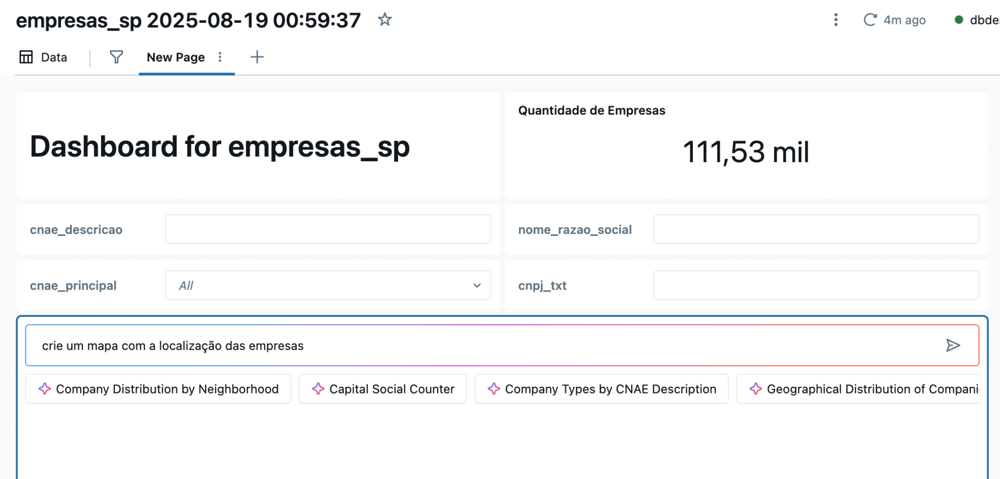

---

### Passo 7 - Faça Investigações Usando os Filtros

Explore seus dados utilizando os filtros criados. Observe como as diferentes visualizações se atualizam dinamicamente conforme você filtra os dados.

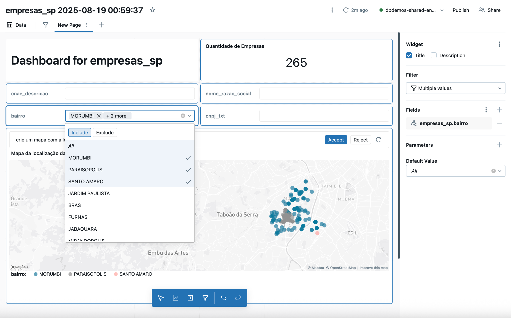

---

### Passo 8 - Explore as Configurações do Mapa

Acesse as configurações avançadas do mapa para personalizar cores, tamanhos, tooltips e outras propriedades visuais.

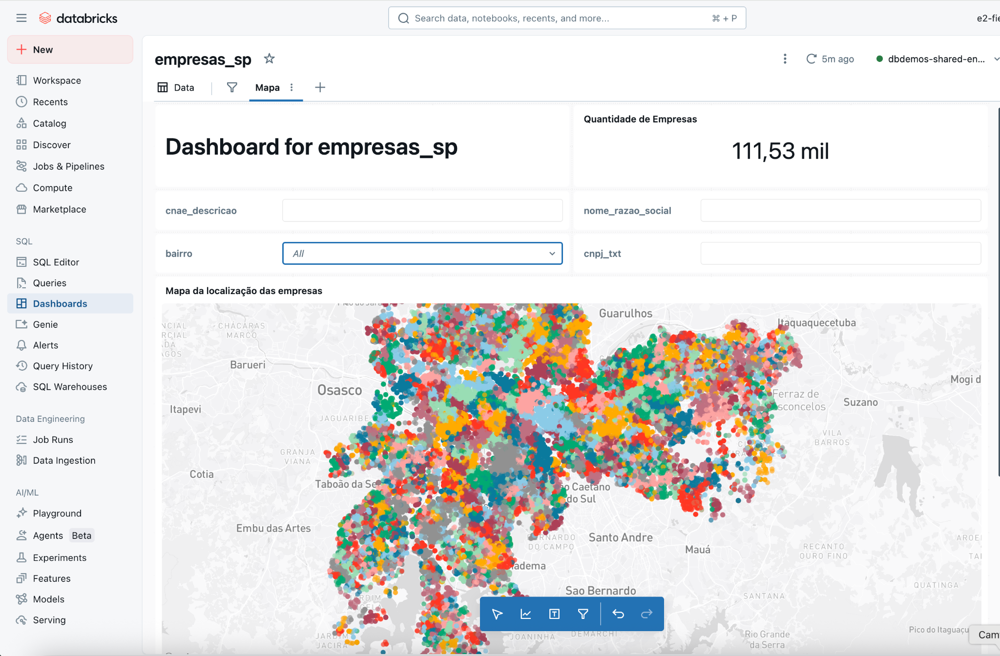

---

### Passo 9 - Outro Dashboard - Inadimplência

Crie um novo dashboard focado na análise de inadimplência, aplicando os conceitos aprendidos anteriormente.

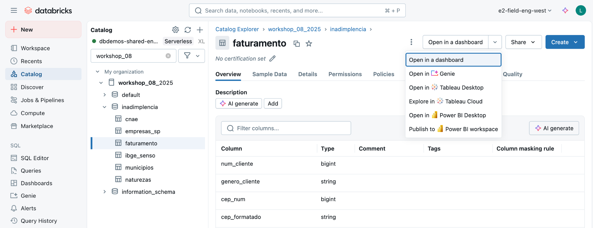

---

### Passo 10 - Configuração Manual de Componente

Aprenda a configurar manualmente os componentes do dashboard para ter controle total sobre a visualização dos dados.

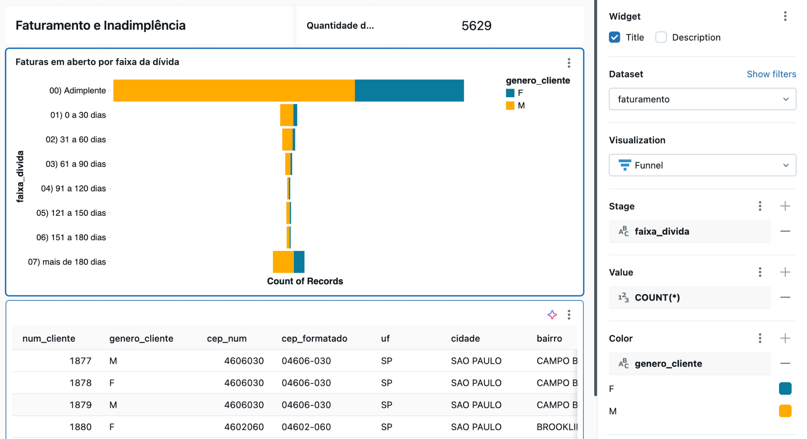

---

### Passo 11 - Mapa da Inadimplência

Crie um mapa específico para visualizar a distribuição geográfica da inadimplência.

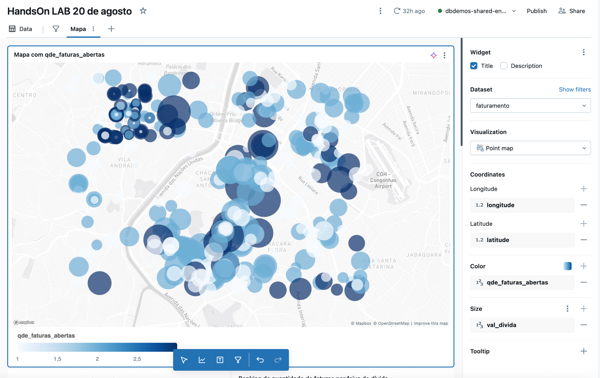

---

### Passo 12 - Configurando a Imagem do Cabeçalho

Personalize seu dashboard adicionando uma imagem no cabeçalho para dar identidade visual ao seu relatório.

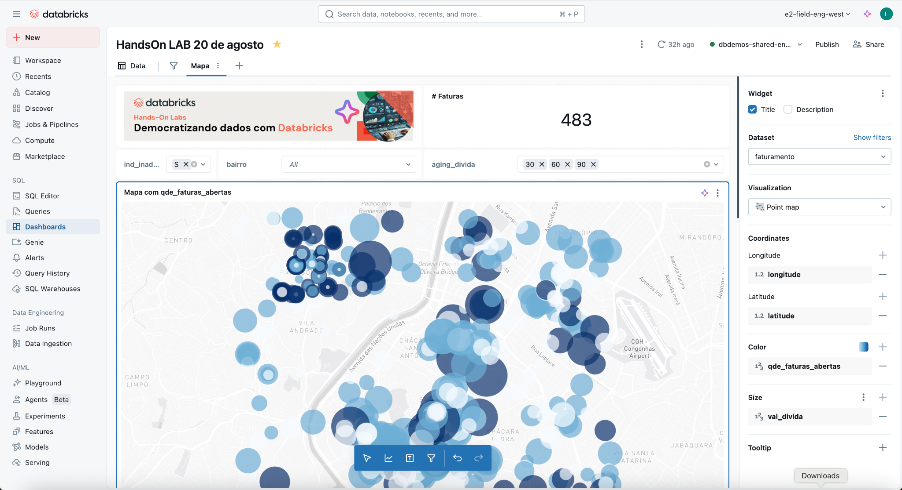

**Exemplo de código para inserir imagem:**

```markdown

```

---

### Passo 13 - Criando Filtros GLOBAIS

Configure filtros globais que afetam todas as páginas e visualizações do seu dashboard simultaneamente.

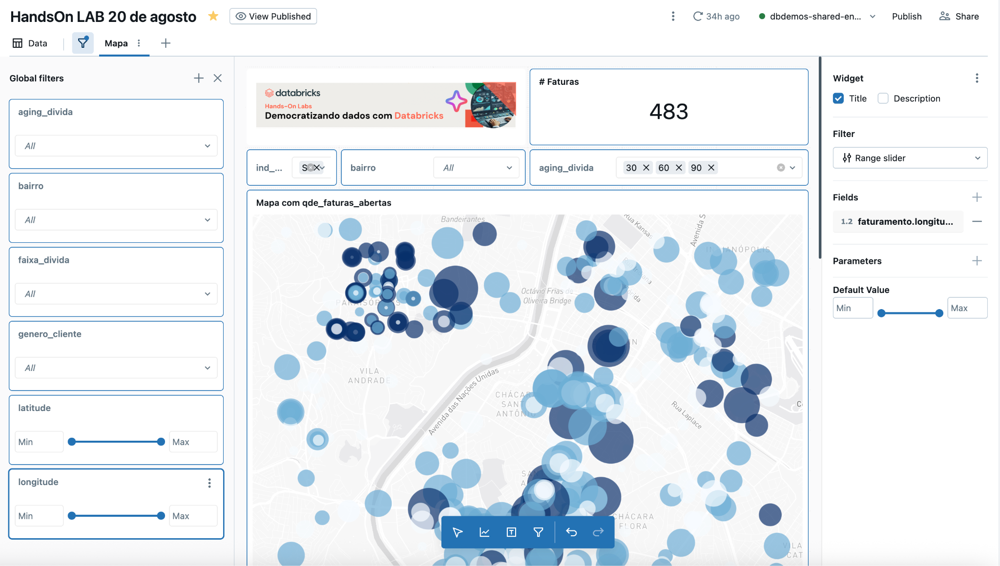

---

### Passo 14 - Publicando o Dashboard

Publique seu dashboard para disponibilizá-lo para outros usuários da organização.

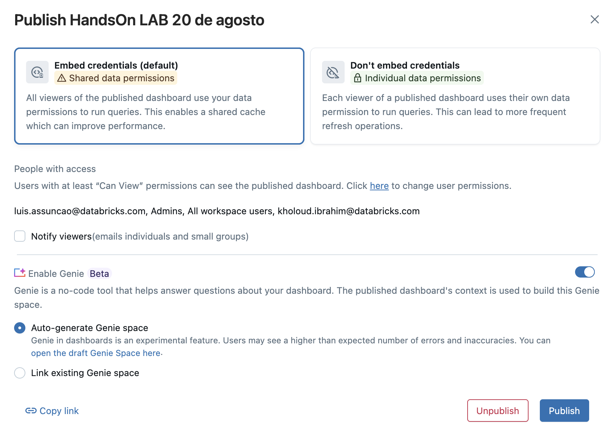

---

### Passo 15 - Testando INSIGHTS com Ask Genie

Utilize o **Ask Genie** para fazer perguntas em linguagem natural sobre seus dados e obter insights automaticamente.

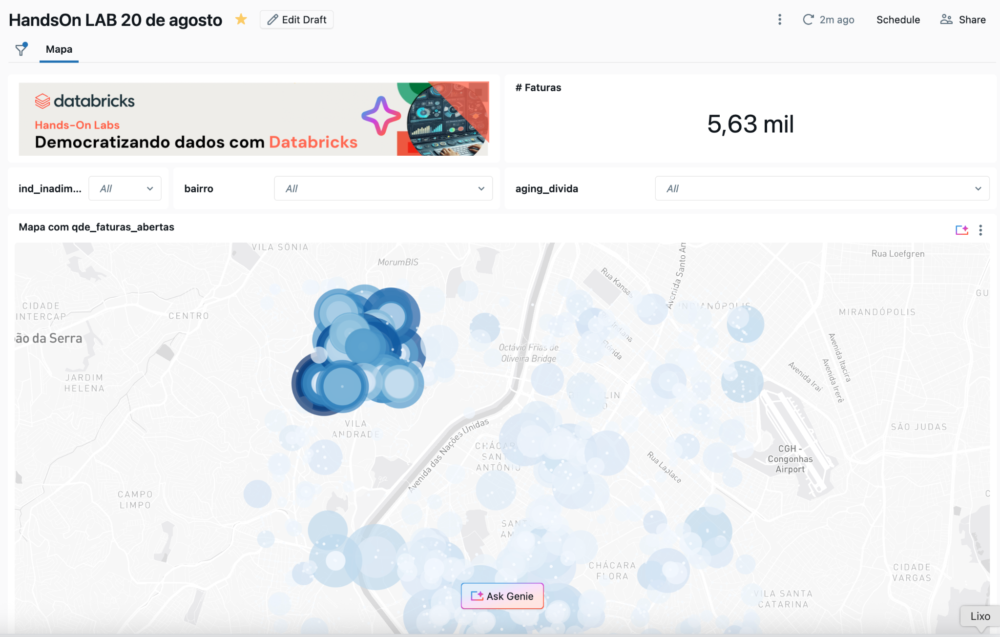

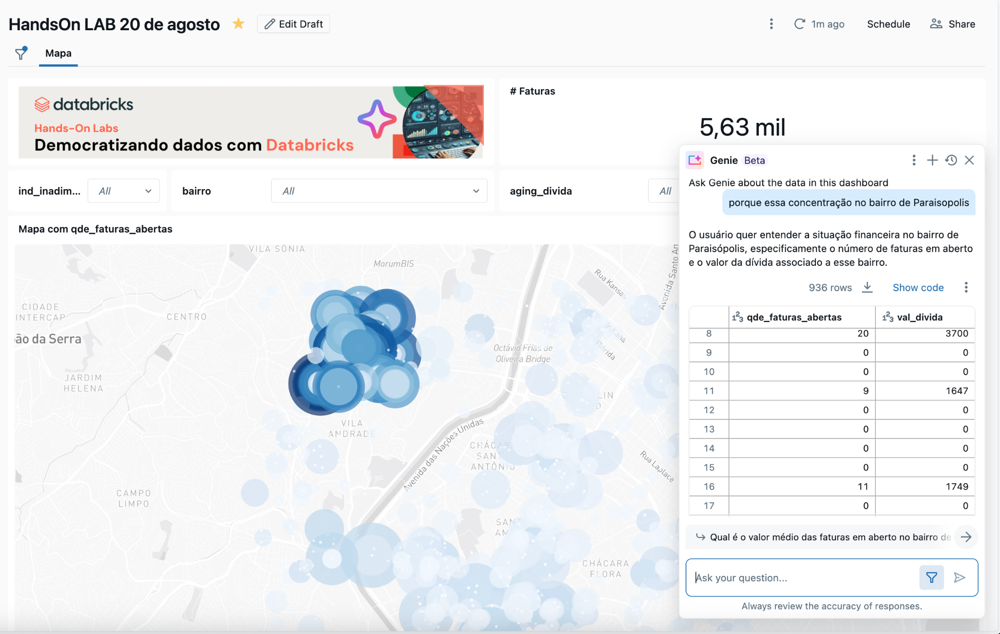

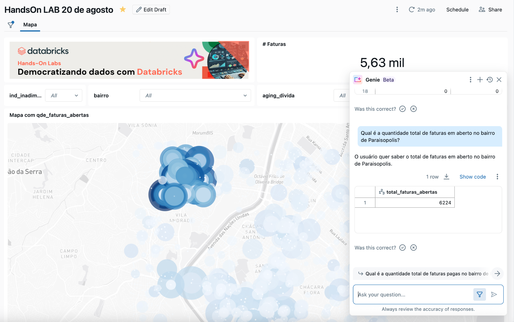

O Ask Genie permite que usuários de negócios façam perguntas como:
- "Qual região tem maior inadimplência?"
- "Mostre a evolução da inadimplência nos últimos 6 meses"
- "Quais são os principais fatores relacionados à inadimplência?"
